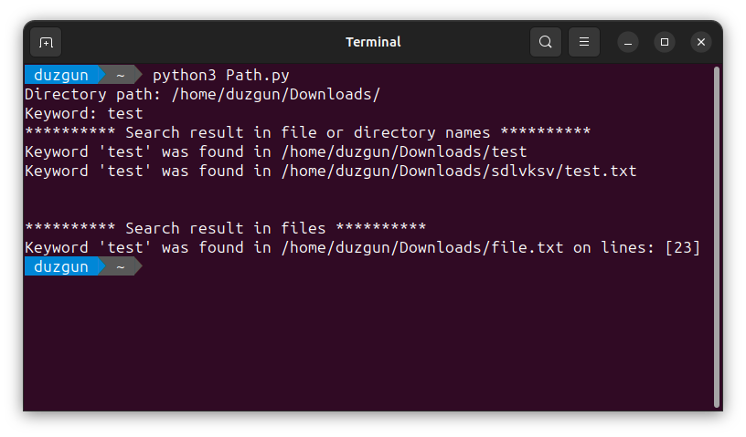

# KeywordSearcher

It searches for the user-entered keyword in the desired folder, its subfolders, and readable text files within those subfolders.


## Installation

There are no specific requirements. Just run the "Path.py" file.

```bash
  python3 Path.py
```
    
## Usage

This tool works in a case-insensitive manner. For example, when searching for the keyword "hi", if it finds the value "Hi", the search is considered successful and it is printed to the screen.

## Screenshots


